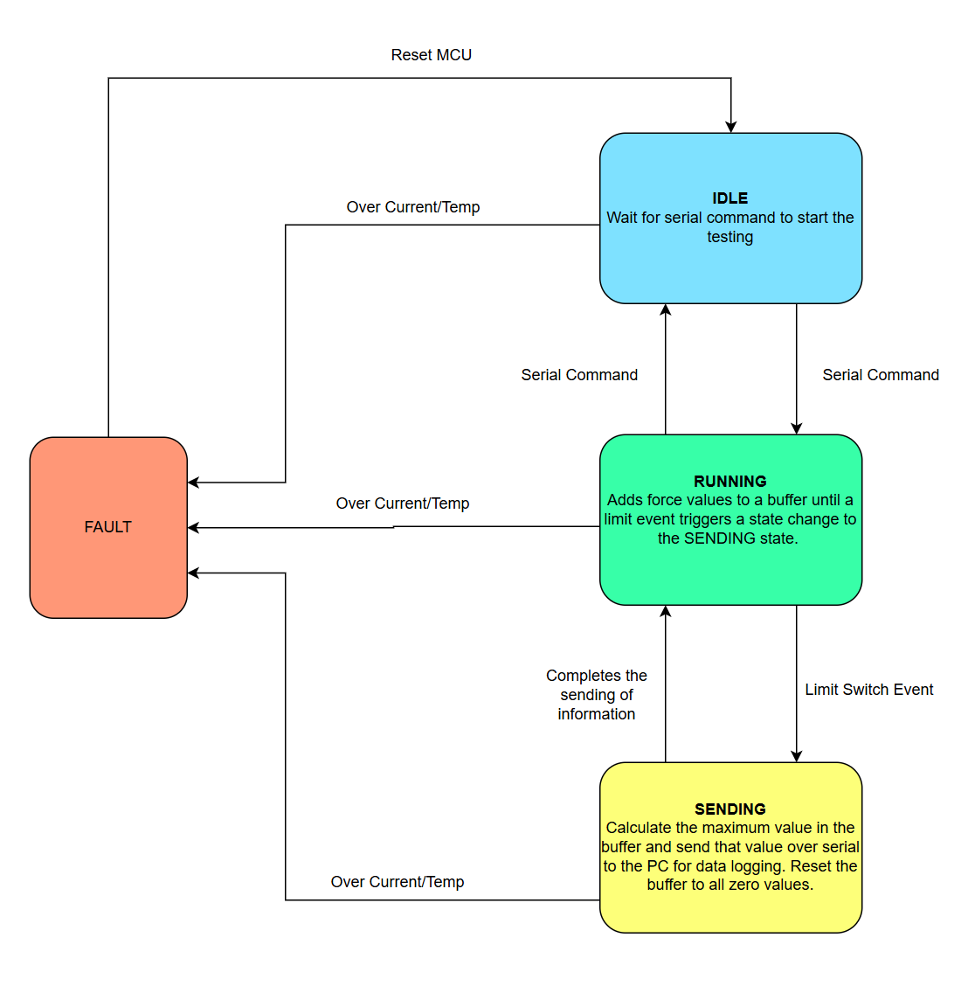
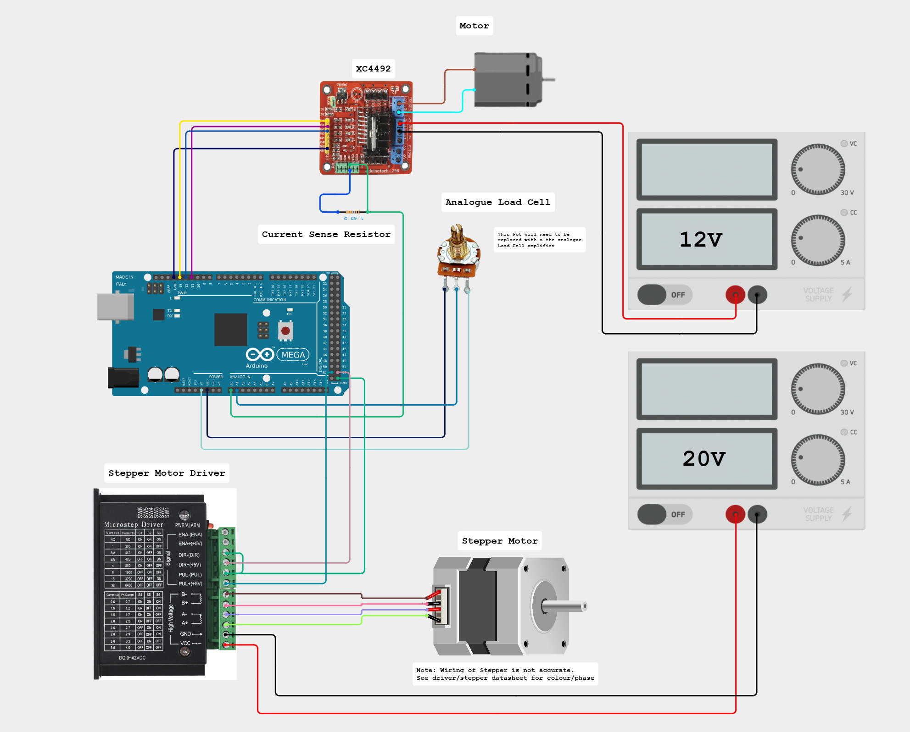
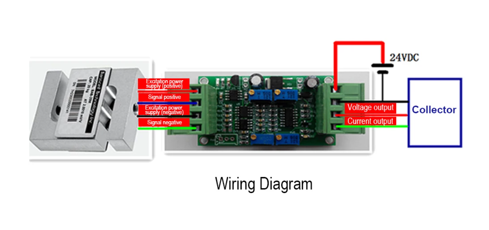

# Cyclic Loading Test Rig

**Author:** Linus Ritchie
**Date:** 2026-01-30

## Overview

This program maintains a constant maximum force applied to a  test rig using a crank–slider mechanism. A control loop adjusts the motor output to match a configured target maximum force. Both the force setpoint and allowable force variation are cofigured in the main.cpp script.

---

## Interface

Upload the progam to the arduino using platoform.io. It is important to adjust the target force value in main.cpp before uploading.

### interface.py

Change the name of the desired output .csv file. If it is left the same as the old tetsing it will just append the results onto the end of that csv.

Run the python script interface.py.

Once you run the script, the python terminal will prompt you to enter a letter to perform an action. Type "R" then hit enter to run the program.

Arduino command parser (taskSerialRecieve):
  'R' -> Running
  'I' -> Idle
  'F' -> Fault

Arduino print format (printSystemState):
  maxForce, targetForce, forceError, nonZeroCount, currentMeasure, StateString

---

## Program Logic

Force measurement is cycle‑based. When the limit switch is triggered, the system begins recording force values into a buffer. On the next trigger, the maximum recorded value is extracted from that buffer, this value sent over serial to the PC, and the buffer is cleared for the next cycle. Because the limit switch is mounted on the crank motor, this occurs once per revolution. The limit switch triggers an interupt resulting in the program being independent of the crank motor speed (if alternate speed motor is used). The sample rate of the load cell may need to be increased if the speed is increased as the number of samples per revolution is relevent to getting accurate maximum force readings.

The rough state machine logic is as follows:

## Wiring

The wiring diagram is as follows:

Note: I forgot to add the NC limit switch connected between PIN 2 and GND. (Pin 2 is one of the Ardunio Mega Interupt Pins)

---

## Limit Switch

The limit switch is configured as an interrupt in `main.cpp`, triggering force-value transmission each revolution. The limit switch needs to be installed on the "Bell Housing" as per the photo.

A test task optionally generates a simulated limit-switch event every 500 ms (2 Hz motor equivalent) for debugging and visualization. This is simply implemented as a task that is triggered on the desired period of a simulated limit switch press. This will need to be disabled when the limit switch is triggered by the motor each run.

The limit switch has been debounced. The time between presses it registers is 200ms. This will be too long for if the motor is configured to run a higher speeds than 2Hz (500ms Time period). You will need to adjust this or change the debouncing method if you want to run the test rig at higher speeds with a faster motor.

---

## Crank Motor

### Power

Requires **12 V** connected to motor driver Vin and GND.

### Current Monitoring

Motor current is measured using a **1.6 Ω** shunt resistor. Voltage–to–current conversion is implemented in `main.cpp`. Over‑current triggers the system to go into a fault state.

If the pin is left floating with nothing connected it will couple with the load cell amp resulting in the load cell value acting as the input for the current measure. If not using the current monitoring bridge the current monitoring analouge pin to GND.

---

## Stepper Motor

### Power

Requires **20–50 V**. Recommended: 20 V lab bench supply. A compatible driver capable of running from **12 V** is on order.

### Stepping Mode

Configured for **1/16 microstepping**. DIP switches can be adjusted for smoother or coarser motion.

### Wiring

Already connected to the Arduino. Ensure correct header orientation: GND (black wire) must align with Arduino GND pins.

---

## Load Cell (TODO)

The load cell will use an analog amplifier to generate an ADC‑compatible signal (Range 0-5V).

TODO:

- Wire load cell and amplifier
- Verify amplifier output
- Integrate into control loop

The load cell amp can be set up just using the potentiometers on the board. When there is no load the zero offset dial can be set. A load can then be applied and the value can be adjusted with the amplification dial untill the correct voltage signal is required.

The wiring of the load cell should be set as per this wiring scheme. It should not be necccesaary to connect the current output or the 0-10V output. The load cell amp will need 12V power.

### Backup Amplifier — HX711

HX711 is available as a fallback. Its **80 Hz max** sample rate is insufficient for accurate peak detection at **2 Hz** crank speed (≈40 samples/rev).
This is only suitable for running a force exterted calibration with the cranker locked out at the start of a test.

---

## Temperature Sensor

A temperature sensor is on order. No interface code written yet. The intended use of this on the cranker motor and is an additional mode of sensing failure.

---

## File Structure

### `src/main.cpp`

Contains:

- State machines
- Task definitions and scheduling
- Control loop logic

Tasks use the **Arduino TaskScheduler** library. `setup()` configures tasks; `loop()` runs the scheduler. All intervals are configurable in `main.cpp`.
